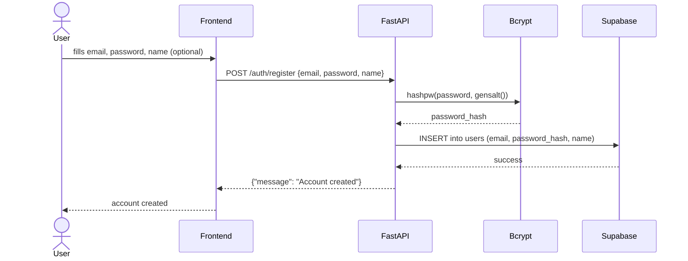

# Register

## Logic

1. The user submits their email, password, and optionally a name
2. The server receives the request at `POST /auth/register`
3. The password is hashed using bcrypt with an auto-generated salt
4. The user data (email, password hash, and name) is inserted into the `users` table in Supabase
5. The server returns a success message

## Diagram

