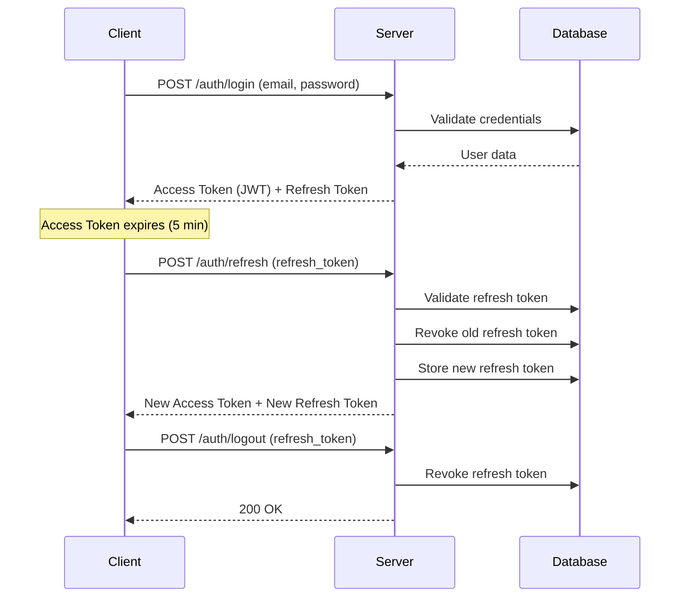
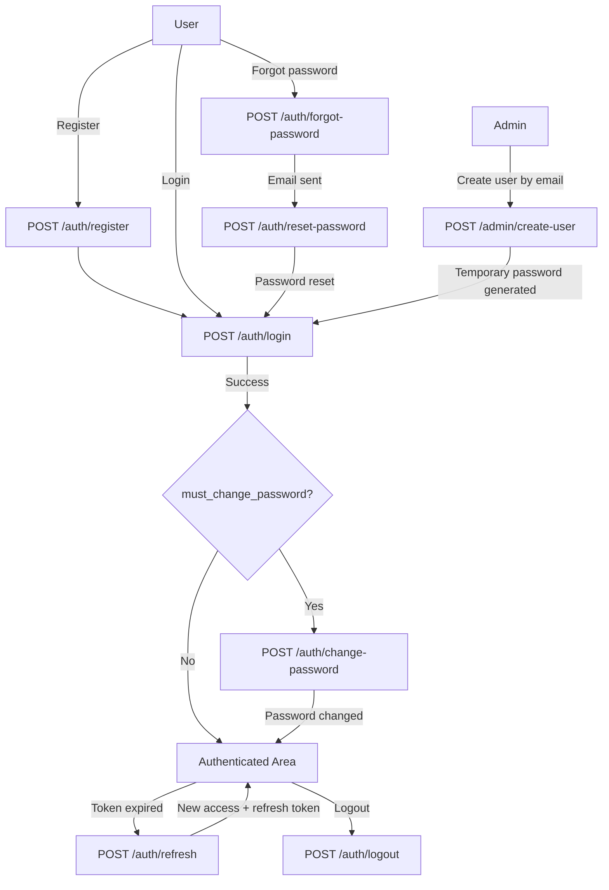
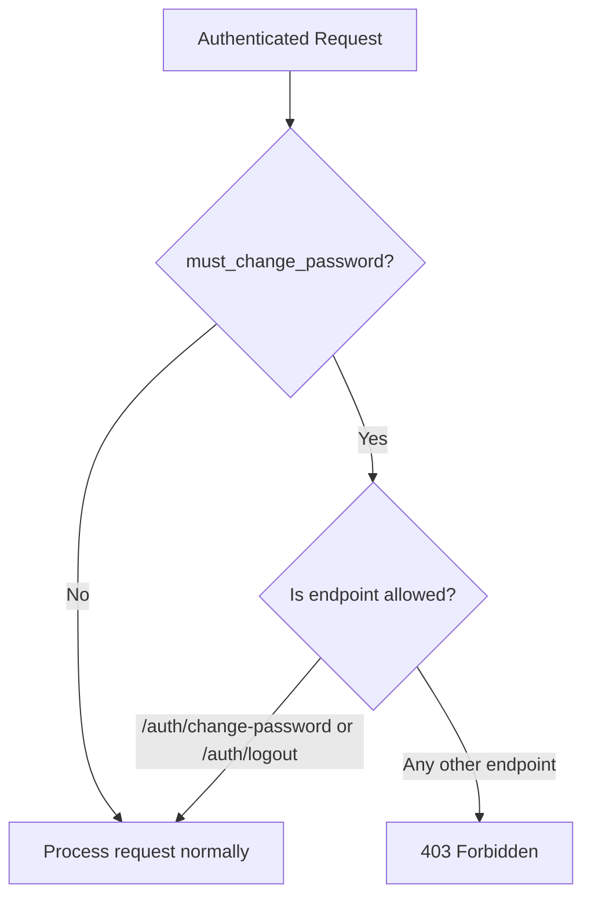
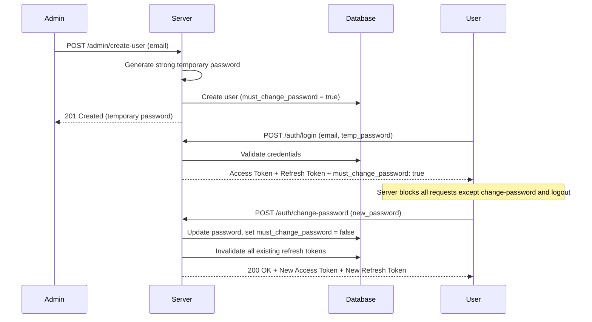
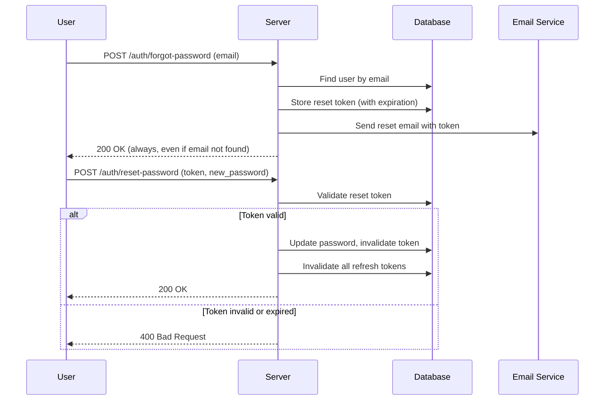

# Overview

## System Description

Auth Service is a single-tenant authentication provider that handles user registration, login, token management, password recovery, and role-based access control.

## Roles

| Role    | Description                                                   |
| ------- | ------------------------------------------------------------- |
| `user`  | Default role. Can access their own data and change password    |
| `admin` | Can do everything a user can, plus create users via email only |

## Token Strategy

### Access Token (JWT, stateless)

- **Expiration:** 5 minutes
- Payload: `user_id`, `email`, `role`, `exp`
- Sent via `Authorization: Bearer <token>` header
- Not stored in the database

### Refresh Token (stateful)

- **Expiration:** 10 minutes
- Stored in the database
- Used to get a new access token without re-login
- **Rotation:** each use invalidates the old refresh token and issues a new one
- Revoked on logout
- **All refresh tokens are invalidated** when password is changed or reset

## Password

### Hashing

- Algorithm: **Argon2id**
- All passwords are hashed before storage
- Plain text passwords are never stored or logged

### Validation

- Minimum length: **5 characters**
- No complexity requirements

## Endpoints Summary

| Endpoint                | Method | Auth Required | Role Required | Description                                  |
| ----------------------- | ------ | ------------- | ------------- | -------------------------------------------- |
| `/auth/register`        | POST   | No            | -             | Register a new user                          |
| `/auth/login`           | POST   | No            | -             | Login and receive tokens                     |
| `/auth/refresh`         | POST   | No            | -             | Rotate tokens (new access + new refresh)     |
| `/auth/logout`          | POST   | Yes           | -             | Revoke refresh token                         |
| `/auth/forgot-password` | POST   | No            | -             | Request password reset email                 |
| `/auth/reset-password`  | POST   | No            | -             | Reset password with token from email         |
| `/auth/change-password` | POST   | Yes           | -             | Change own password (forced after temp pass) |
| `/admin/create-user`    | POST   | Yes           | `admin`       | Create user by email with temporary password |

## General Flow

## must_change_password Enforcement

When a user has `must_change_password = true`, the **server** blocks all requests except:

- `POST /auth/change-password`
- `POST /auth/logout`

Any other authenticated request returns `403 Forbidden` with a message indicating the user must change their password first.

## Temporary Password Flow

## Forgot Password Flow

## Rate Limiting

| Endpoint                | Limit              | Strategy       |
| ----------------------- | ------------------ | -------------- |
| `/auth/login`           | 5 attempts / 5 min | Per IP + email |
| `/auth/register`        | 5 attempts / 5 min | Per IP         |
| `/auth/forgot-password` | 5 attempts / 5 min | Per IP         |

When the limit is reached, the server responds with `429 Too Many Requests`.

## Email

Provider to be defined. Options for development:

- **Mailtrap** — Free tier, email sandbox for testing
- **Resend** — Free tier (100 emails/day)
- **MailHog** — Local SMTP server with web UI

The email service must be abstracted so the provider can be easily swapped.
